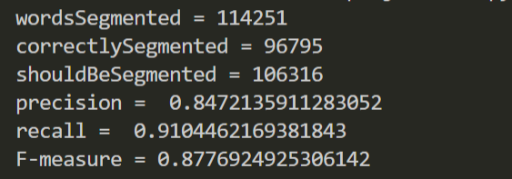
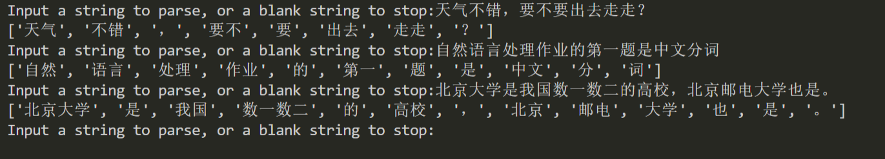
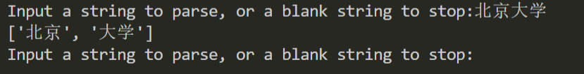
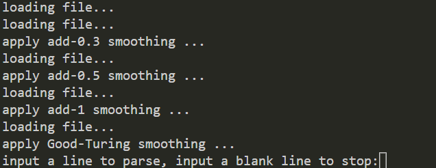
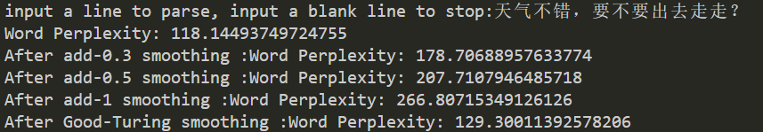
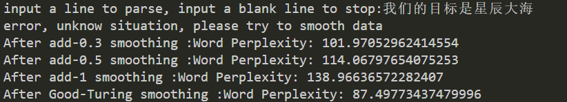
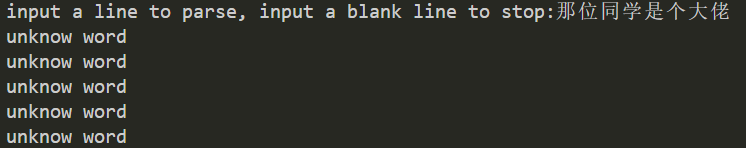
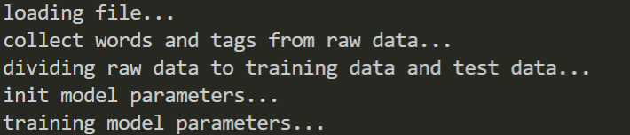
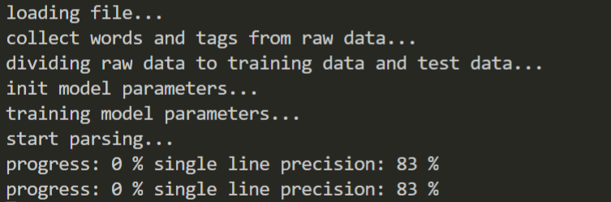
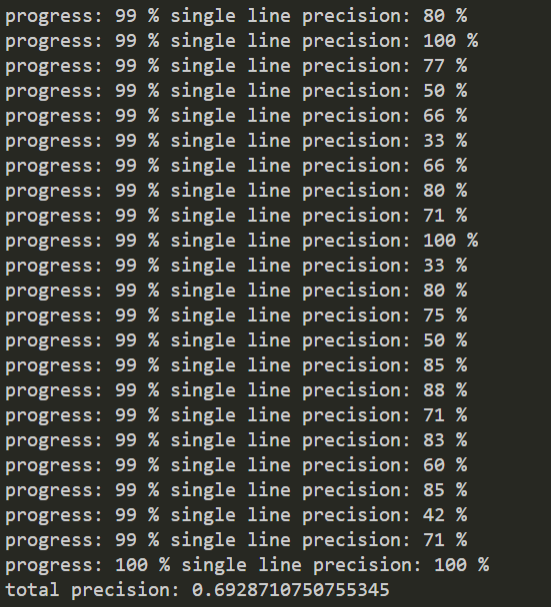

# NLP-homework

大三上-自然语言处理导论作业

## 环境

python3

## Project-1 - Chinese word segmentation.

### 任务定义

This task provides PKU data as training set and test set(e.g., you can use 80% data for model training and other 20% for testing), and you are free to use data learned or model trained from any resources.

Evaluation Metrics:
- Precision = (Number of words correctly segmented) / (Number of words segmented) * 100%
- Recall = (Number of words correctly segmented) / (Number of words in the reference) * 100%
- F-measure = 2 * P * R / (P + R)

### 文件目录

- project-1/
  - 1.py - 源代码
  - lcs.py - 基于动态规划算法的求最长公共子序列函数，用于在1.py中计算困惑矩阵
  - play.py - 基于1.py改造而成的玩具程序，用于自定义输入的分词
  - data/
    - pku_training.utf8 - 北京大学中文分词训练词库，词与词之间使用两个空格分隔，段落之间使用换行符分隔
    - pku_training_words.utf8 - 北京大学中文分词训练词库，词与词之间使用换行符分隔
    - pku_test.utf8 - 北京大学中文分词测试词库。为未分词的文章
    - pku_test_gold.utf8 - pku_test.utf8分词后的标准答案

### 方法描述

主要思想：**基于窗口的前向最大匹配**，即在最大前向匹配的基础上添加一个look ahead窗口，防止匹配`北京大学`时因为有`北京`这个词却没有`北京大`这个词而拆分`北京大学`为`北京`和`大学`这样的情况。

由于look ahead窗口的可变性，把分词器设置为一个class - `Segmentor`，而look ahead窗口的大小设置在其构造函数中，作为参数`lookAhead`，默认窗口大小为1。

`Segmentor`类的结构如下：
- `wordSet`
  - 词库，数据结构为`set`，存放所有中文词
- `lookAhead`
  - look ahead窗口大小，默认为1
- `__init__(self, fileName = '', lookAhead = 1)`
  - 构造函数。初始化成员变量。
  - 初始化look ahead窗口大小。
  - 如果给出了文件名则调用函数`self.openFile`。
- `openFile(self, fileName)`
  - 把指定文件作为训练文件导入`wordSet`
- `parse(self, string)`
  - 基于`wordSet`解析输入串

`Segmentor.parse`函数代码逻辑如下：

```python
def parse(self, string):
'parse string using word set and return result as an array'

resultWords = [] # 保存分词结果，是词的list
currentLookAhead = 0 # 当前look ahead的情况，用来和self.lookAhead对比
startIndex = 0 # 指向当前词的词首
currentIndex = 0 # 指向当前词的词尾

while currentIndex < len(string): # 当前词的词尾不是输入串尾
	if currentLookAhead < self.lookAhead: # look ahead的字符数小于look ahead窗口
		currentLookAhead += 1 # 向前看+1
		if currentIndex + currentLookAhead < len(string) \
		and string[startIndex : currentIndex + currentLookAhead + 1] in self.wordSet:
			# 向前看未越界且匹配到了更长的词
			currentIndex += currentLookAhead # 刷新词尾指针
			currentLookAhead = 0 # 重置当前look ahead字符数
		elif currentIndex + currentLookAhead >= len(string): # 向前看越界
			resultWords.append(string[startIndex : currentIndex + 1]) # 把当前词加入结果
			startIndex = currentIndex + 1 # 刷新词首指针为上一个词的词尾+1
			currentIndex += 1 # 刷新词尾指针为上一个词的词尾+1
			currentLookAhead = 0 # 重置look ahead字符数
	else: # look ahead超过窗口大小
		resultWords.append(string[startIndex : currentIndex + 1]) # 把当前词加入结果
		startIndex = currentIndex + 1 # 刷新词首指针为上一个词的词尾+1
		currentIndex += 1 # 刷新此位置指针为上一个词的词尾+1
		currentLookAhead = 0 # 重置look ahead字符数

# 词串解析完毕。startIndex和currentIndex可能还指着最后一个词
if startIndex < currentIndex: # 如果指向最后一个词
	resultWords.append(string[startIndex : currentIndex + 1]) # 把最后一个词加入结果

return resultWords
```

### 程序工作流程

```python
# 定义分词器，指定训练文件和look ahead窗口尺寸
segmentor = Segmentor('data/pku_training_words.utf8', 5)

# 为了计算困惑矩阵，定义一些计数器
wordsSegmented = 0 # 分词器分出了多少词
correctlySegmented = 0 # 分词器正确分出了多少词
shouldBeSegmented = 0 # 分词器应该分出多少词

# 考虑到需要最长公共子序列需要一个很大的二维matrix，所以对于输入的测试文件，一行一行分析
testFile = open('data/pku_test.utf8', 'r', encoding = 'utf-8')
goldFile = open('data/pku_test_gold.utf8', 'r', encoding = 'utf-8')
testLine = testFile.readline() # 测试文件读一行
goldWords = goldFile.readline().split('  ') # 结果文件读一行
while len(testLine) and len(goldWords): # 没有读到文件尾
	testWords = segmentor.parse(testLine) # 解析一行，得到结果词串
	wordsSegmented += len(testWords) # 计数
	correctlySegmented += lcs.LCS_Length(testWords, goldWords) # 使用最长公共子序列计算正确分词个数，计数
	shouldBeSegmented += len(goldWords) # 计数
	testLine = testFile.readline() # 继续循环
	goldWords = goldFile.readline().split('  ') # 继续循环
testFile.close() # 关闭文件
goldFile.close()

# 输出结果
print('wordsSegmented =', wordsSegmented)
print('correctlySegmented =', correctlySegmented)
print('shouldBeSegmented =', shouldBeSegmented)
p = correctlySegmented / wordsSegmented
r = correctlySegmented / shouldBeSegmented
print('precision = ', p)
print('recall = ', r)
print('F-measure =', 2 * p * r / (p + r))
```

### 输入输出与运行截图

以下测试均使用project-1/data/pku_training_words.utf8作为训练数据，向前窗口大小为5

1.py不需要输入，输出如下：



play.py可以自由输入，样例输入与输出如下：



如果把向前窗口设置为1，则不能够正确解析“北京大学”：



### 结果分析

测试改变向前窗口大小对结果造成的影响。

| 向前窗口大小 | 正确率 | 召回率 | F综合评估 |
| --- | --- | --- | --- |
| 1 | 80.49% | 70.08% | 0.85 |
| 2 | 83.29% | 90.72% | 0.87 |
| 3 | 84.56% | 91.00% | 0.88 |
| 5 | 84.72% | 91.04% | 0.88 |
| 8 | 84.74% | 91.05% | 0.88 |

可以看出：
- 增大向前窗口的大小可以提升系统性能。但是向前窗口为默认大小1的时候性能也不是很差。
- 向前窗口大小由1提升为2的时候能够明显提升系统性能，但是向前窗口继续增加时性能提升并不明显。原因应该是没有很多很长的中文词。如果要继续提升性能，应该尝试优化算法而不是继续改变向前窗口大小。

## Project-2 - N-gram Language Models.

### 任务定义

In this assignent you will explore a simple, typical N-gram language model.

This model can be trained and tested on sentence-segented data of a Chinese text corpus. "Word Perplexity" is the most widely-used evaluation metric for language models.

Additional points:
- Test how does the different "Word Perplexity" of the different "N" grams.
- Test how does the different "Word Perplexity" of the different smoothing methods.

### 文件目录

- project-2/
  - 2.py - 程序源代码
  - data/
    - TheThreeBodyProblem.txt - 小说《三体》，用作训练数据

### 方法描述

使用传统n gram模型

定义一个class - `N_Gram`，其构造函数的参数包括了模型参数`n`。类内有不同的平滑方案，定义类的对象之后调用不同的平滑方案来得到不同的平滑结果。

`N_Gram`类的结构如下：
- `history`
  - 历史的长度，即`n-1`
- `data`
  - 保存前`n-1`个词确定时最后一个词的出现次数。用来和`dataTimes`结合计算概率。
- `dataTimes`
  - 保存前`n-1`个词构成的词串的出现次数。用来和`data`结合计算概率。
- `wordSet`
  - 所有中文字的集合
- `smoothing`
  - 保存当前使用了哪种平滑方法
- `__init__(self, n, fileNme = '')`
  - 初始化成员变量。
  - 根据参数`n`获得`history = n - 1`。
  - 如果给出了`fileName`则调用`openFile`函数读取文件。
- `openFile(self, fileName)`
  - 根据指定文件填充`wordSet`。
  - 以行为单位构造`data`和`dataTimes`
  - 构造时会根据n gram的参数n在行首和行位添加适量的标记符
- `historyGenerator(self, historyLength = -1)`
  - 用于根据`self.history`长度和`self.wordSet`来构造历史词
  - 为递归函数，使用了生成器技术，减少内存的使用
- `additiveSmoothing(self, n = 1.0)`
  - 使用加性平滑处理`data`和`dataTimes`，平滑系数n由参数给出
  - 把`self.smoothing`设置为additive smoothing
- `goodTuringSmoothing(self)`
  - 使用Good-Turing平滑处理`data`和`dataTimes`
  - 对于`n(r+1)`为0的情况，跳过不处理
  - 把`self.smoothing`设置为Good-Turing smoothing
- `parse(self, s)`
  - 解析输入串`s`
  - 如果输入串包含字库中没有的字，停止解析
  - 如果输入串长度过短，停止解析
  - 如果输入串中的字都存在在字库中，但是出现了`data`中没有的情况，则需要平滑处理，输出提示并停止解析
  - 解析成功时，输出困惑度
  - 如果使用了平滑方案，输出困惑度时会输出平滑方案

`N_Gram.parse`代码逻辑如下：

```python
def parse(self, s):
# 判断是否存在不在词库中的字
for word in s:
	if not word in self.wordSet:
		print('unknow word')
		return

# 判断输入串长度是否过短
s = self.history * '\n' + s + self.history * '\n'
if len(s) < self.history + 1:
	print('string too short')
else:
	result = 1 # 结果困惑度
	for i in range(self.history, len(s)):
		if s[i - self.history : i] in self.data and s[i] in self.data[s[i - self.history : i]]:
			# data中存在此情况
			# 计算困惑度
			result *= (self.data[s[i - self.history : i]][s[i]] / \
			self.dataTimes[s[i - self.history : i]]) ** -(1 / len(s)) # 乘方运算在此处进行以防止result太小变成0
		else:
			# 未知情况，应该平滑
			print('error, unknow situation, please try to smooth data')
			return
	if len(self.smoothing): # 如果使用了平滑策略，则输出平滑策略
		print('After', self.smoothing, ':', end = '')
	print('Word Perplexity:', result) # 输出困惑度
```

### 程序工作流程

以使用bigram为例：

```python
# 定义5种bigram：不平滑、0.3-加性平滑、0.5-加性平滑、1-加性平滑和GT平滑
b = N_Gram(2, 'data/TheThreeBodyProblem.txt') # bigram
b_0_3 = N_Gram(2, 'data/TheThreeBodyProblem.txt') # bigram with add-0.3 smoothing
b_0_3.additiveSmoothing(0.3)
b_0_5 = N_Gram(2, 'data/TheThreeBodyProblem.txt') # bigram with add-0.5 smoothing
b_0_5.additiveSmoothing(0.5)
b_1 = N_Gram(2, 'data/TheThreeBodyProblem.txt') # bigram with add-1 smoothing
b_1.additiveSmoothing(1)
b_gt = N_Gram(2, 'data/TheThreeBodyProblem.txt') # bigram with good-turing smoothing
b_gt.goodTuringSmoothing()

s = input('input a line to parse, input a blank line to stop:')
while len(s):
	b.parse(s)
	b_0_3.parse(s)
	b_0_5.parse(s)
	b_1.parse(s)
	b_gt.parse(s)
	s = input('input a line to parse, input a blank line to stop:')
```

### 输入输出与运行截图

以bigram为例

初始状态，系统读入文件，输出提示信息：



输入串，解析并获得困惑度：



输入一个不平滑时无法解析的串：



输入一个含有字库外的字的串：



### 结果分析

输入串为“天气不错，要不要出去走走？”，对于不同的n gram参数n，以及不同的平滑方案，得到困惑度表格如下：

| n | 不平滑 | 0.3加性平滑 | 0.5加性平滑 | 1加性平滑 | GT平滑 |
| --- | --- | --- | --- | --- | --- |
| 1 | 379.56 | 379.92 | 380.16 | 380.76 | 393.33 |
| 2 | 118.14 | 178.71 | 207.71 | 266.81 | 129.30 |

n=3时因内存不足(测试环境内存8G)，无法得到训练结果。

结论：
- 无论是否采取平滑或采取任何平滑，增加n都是减少困惑度最有效的方案
- 模型所需内存随着n的增加而非常快速地增加，故高阶可计算性较差
- 因为平滑把词库中存在的词的概率分配给了不存在的词，所以不平滑相比平滑困惑度较低，但是不平滑可能会无法识别一些词库外的情况。
- 加性平滑的参数不建议使用1，使用较小的参数能够得到更低的困惑度
- n=1时频率为0的情况较少，GT平滑效果不如加性平滑。但是n>=2时概率为0的情况急剧增多，GT平滑效果明显优于加性平滑。

## Project-3 - Part-of-speech tagging.

### 任务定义

This data set contains one month of Chinese daily which are segmented and POS tagged under Peking Univ. standard.

Project ideas:
- Design a sequence learning methods to predicate a POS tags for each word in sentences.
- Use 80% data for model training and other 20% for testing(or 5-fold cross validation to test learner's performance. So it could be interesting to seperate dataset).

### 文件目录

- project-3/
  - 3.py - 程序源代码
  - data/
    - data.txt - 来自老师邮箱的数据集，已使用正则表达式去除了里面的中括号、大括号和连续换行等无关内容

### 方法描述与程序执行流程

使用80%数据作为训练集，20%数据作为测试集。使用隐马尔可夫模型，1-加性平滑策略。

此次没有需要手动输入的模型参数，故没有像前两题一样设置一个class出来，完全使用面向过程编程。

程序执行流程
1. 加载文件，数据保存到`rawData`
2. 从`rawData`中获取`tags`和`words`
3. 把`rawData`按照比例划分为`trainingData`和`testData`
4. 定义模型参数`tagTrans`为词性标签之间的状态转移概率，`emit`为某个标签发射某个词的概率
5. 使用`trainingData`训练模型参数`tagTrans`和`emit`
6. 使用Viterbi算法处理`testData`，得到模型输出结果
7. 计数与输出

处理`testData`的流程：

```python
print('start parsing...') # 输出提示信息
allCorrectCount = 0 # 整个测试数据中正确标签的词数。忽略段落起始符和结束符
allWordsCount = 0 # 整个测试数据的词数，忽略段落起始符和结束符
# 最终精度 = allCorrectCount / allWordsCount
for index in range(len(testData)):
	line = testData[index] # 每次从测试数据中提取一行，即line
	allWordsCount += len(line) # 计数，此时line不包括段落起始符和结束符
	line = ['$start$/$start$'] + line + ['$end$/$end$'] # 加上段落起始符和结束符
	# 从line中提取词和标签
	testWords = []
	testTags = []
	for item in line:
		testWords.append(item.split('/')[0])
		testTags.append(item.split('/')[1])

	# 初始化Viterbi矩阵
	v = [[0 for x in range(len(tags))] for y in range(len(line))] # v[len(line)][len(tags)] Viterbi矩阵
	path = [[0 for x in range(len(tags))] for y in range(len(line))] # path[len(line)][len(tags)] 记录路径
	# 初始化Viterbi矩阵
	for j in range(len(tags)):
		v[1][j] = tagTrans[tags[0] + ' ' + tags[j]] * emit[tags[j] + ' ' + testWords[1]]
		path[1][j] = 0 # path[1][j] = $start$
	# 前向递推
	for t in range(2, len(testWords)):
		for j in range(len(tags)):
			for i in range(len(tags)):
				p = v[t - 1][i] * tagTrans[tags[i] + ' ' + tags[j]] * emit[tags[j] + ' ' + testWords[t]]
				if p > v[t][j]:
					v[t][j] = p
					path[t][j] = i
	# 结果概率为v[len(line) - 1][len(tags) - 1]

	# 构造结果list
	resultIndex = [0 for x in range(len(line))] # 记录结果的tag list在tags中的下标。包括段落起始符和结束符
	resultIndex[0] = 0 # $start$ 段落起始符
	resultIndex[-1] = len(tags) - 1 # $end$ 段落结束符
	for i in reversed(range(len(line) - 1)): # 逆推path，即构造结果的tag路径
		resultIndex[i] = path[i + 1][resultIndex[i + 1]]
	# 根据resultIndex构造result
	result = [] # 是tag的list
	for i in resultIndex:
		result.append(tags[i])

	# 输出结果
	correctCount = 0 # 单行正确标记个数
	for i in range(len(result)):
		if result[i] == testTags[i]: # 标记正确
			correctCount += 1 # 单行正确标记个数+1
			allCorrectCount += 1 # 整个测试数据正确标记个数+1
	print('progress:', (index + 1) * 100 // len(testData), '%', 'single line precision:', \
	(correctCount - 2) * 100 // (len(result) - 2), '%') # 输出当前进度和单行结果。-2是为了去掉段落起始符和结束符
	allCorrectCount -= 2 # 段落起始符和结束符必定匹配正确。减去这两个符号
print('total precision:', allCorrectCount / allWordsCount) # 输出总正确率
```

### 输入输出与运行截图

此程序不需输入。

初始，输出如下提示信息：



开始解析测试集，输出当前进度和单行正确率：



解析结束，输出总正确率：



### 结果分析

性能：总数据约20000行。其中测试数据约4000行(20%)，全部解析用时约30分钟。且需要在运行中申请大量存储空间，使用python性能明显不如其他同学使用c++编写的程序的性能。

正确率：约70%。经过debug可以发现句首词性较易分析正确，一旦句子中出现一次分析错误，后面的词性可能都是错的，引起恶性循环。所以短句更容易匹配出100%，也可能出现0%。若要提高正确率，可以修改模型，尝试向前看更多的词。